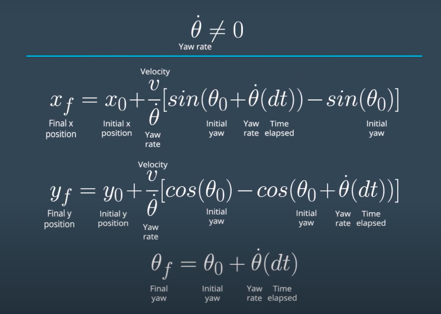
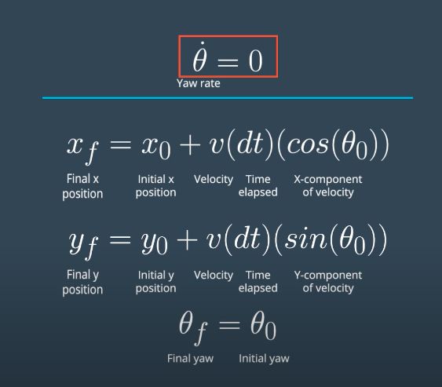

## Project Introduction
Your robot has been kidnapped and transported to a new location! Luckily it has a map of this location, a (noisy) GPS estimate of its initial location, and lots of (noisy) sensor and control data.

In this project you will implement a 2 dimensional particle filter in C++. Your particle filter will be given a map and some initial localization information (analogous to what a GPS would provide). At each time step your filter will also get observation and control data.

## Running the Code
This project involves the Term 2 Simulator which can be downloaded [here](https://github.com/udacity/self-driving-car-sim/releases)

This repository includes two files that can be used to set up and install uWebSocketIO for either Linux or Mac systems. For windows you can use either Docker, VMware, or even Windows 10 Bash on Ubuntu to install uWebSocketIO.

Once the install for uWebSocketIO is complete, the main program can be built and ran by doing the following from the project top directory.

1. mkdir build
2. cd build
3. cmake ..
4. make
5. ./particle_filter

Alternatively some scripts have been included to streamline this process, these can be leveraged by executing the following in the top directory of the project:

1. ./clean.sh
2. ./build.sh
3. ./run.sh

Tips for setting up your environment can be found [here](https://classroom.udacity.com/nanodegrees/nd013/parts/40f38239-66b6-46ec-ae68-03afd8a601c8/modules/0949fca6-b379-42af-a919-ee50aa304e6a/lessons/f758c44c-5e40-4e01-93b5-1a82aa4e044f/concepts/23d376c7-0195-4276-bdf0-e02f1f3c665d)

Note that the programs that need to be written to accomplish the project are src/particle_filter.cpp, and particle_filter.h

The program main.cpp has already been filled out, but feel free to modify it.

Detailed Code input and output parameters, please refer to orginial [Udacity Repo](https://github.com/udacity/CarND-Kidnapped-Vehicle-Project)

## Code Explanation
The code flowchart is shown at below. 

First initialize the the particle filter object with the first position vales and add GPC noise distribution onto them. Also populated all particles with weight of 1
 
Next, predict the location of the every particle base on the previous  Yaw rate and Velocity values along with their noise.

Then at "Update Step", scan through every particles and translate the landmarks location and feature measurement based on the current particles coordinates. And then use closest neighbour logic to find the best sensor reading and assign the landmark ID to it.
Then, update the weight of the particle by multiplying all measurements' Multivariate-Gaussian probability density.

Now at the key part of the logic --  "Re-sampling". The weight of the particles represent the probability of this particle been randomly picked to be the next iteration of particles. I used [std::discrete_distribution](http://en.cppreference.com/w/cpp/numeric/random/discrete_distribution) instead of resampling wheel shown in the class.

For the next iteration, the number of particles would stay the same but the list was re-sampled based on their weights calculated previous iteration. 

### Hint
Be cautious whenever you have incoming variable that been processed at denominator of a division. 
Here in this project, the yaw rate could be zero and when it is zero, the prediction step need to use a different equation.

## Result Video
